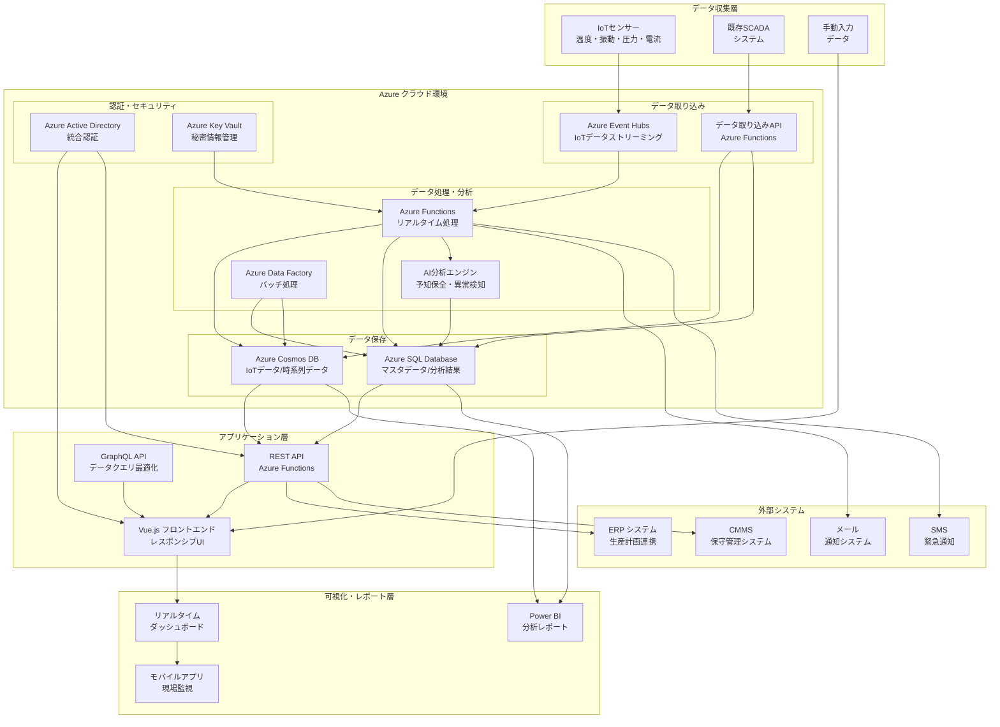
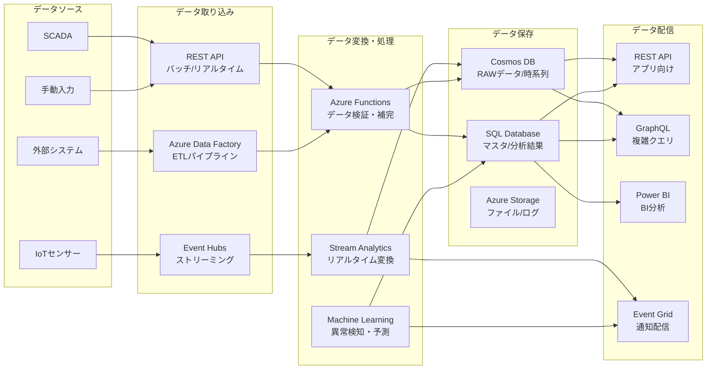
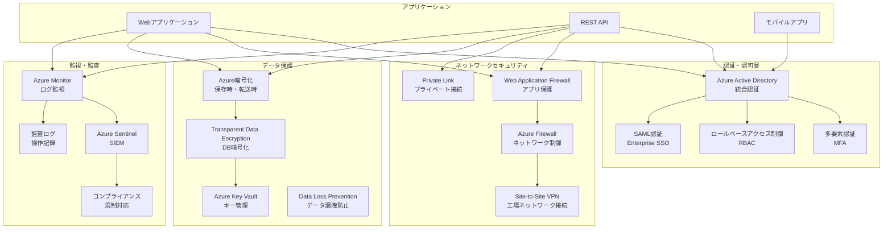
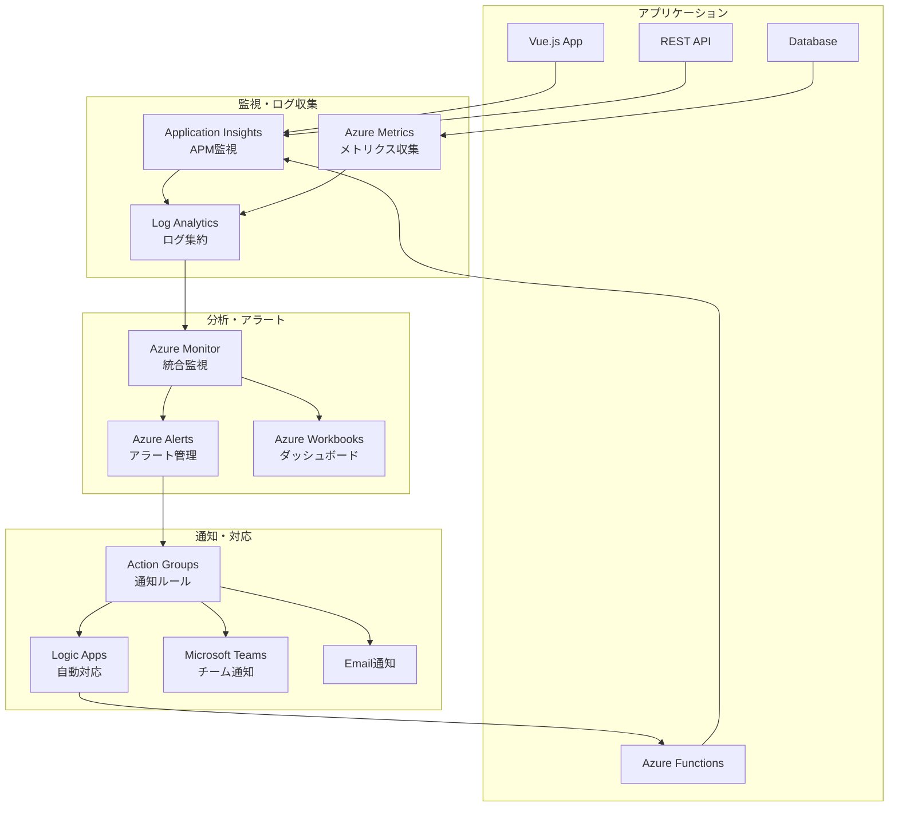
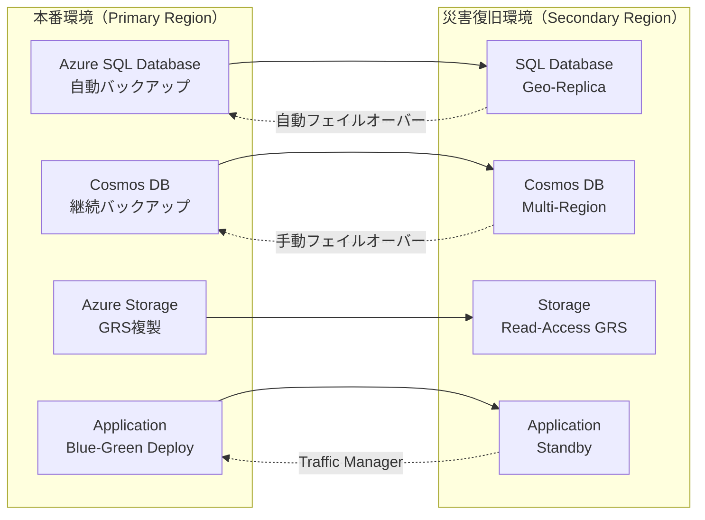

# 工場設備管理システム - アプリケーションアーキテクチャ設計書

## 1. システム全体アーキテクチャ

### 1.1 システム構成概要

### 1.2 アーキテクチャの特徴

#### マイクロサービスアーキテクチャ
- 各機能を独立したサービスとして実装
- スケーラビリティと保守性を向上
- 障害の局所化とシステム全体の可用性向上

#### サーバーレスアーキテクチャ
- Azure Functionsによる自動スケーリング
- 使用量に応じた課金でコスト最適化
- 運用管理の簡素化

#### イベントドリブンアーキテクチャ
- リアルタイムデータ処理
- 非同期処理による高いスループット
- システム間の疎結合

## 2. データアーキテクチャ

### 2.1 データフロー詳細

### 2.2 データ保存戦略

#### ホット・ウォーム・コールドデータ分離
- **ホットデータ**: 直近24時間のリアルタイムデータ（Cosmos DB）
- **ウォームデータ**: 過去30日の分析用データ（SQL Database）
- **コールドデータ**: 3年保管の履歴データ（Azure Storage）

#### データパーティション戦略
- 時間ベースパーティション（日・月単位）
- 設備IDベースパーティション
- 地理的分散によるパフォーマンス最適化

## 3. セキュリティアーキテクチャ

### 3.1 セキュリティ層別構成

### 3.2 セキュリティ要件

#### 認証・認可
- Azure Active Directory統合によるSSO
- 多要素認証（MFA）必須
- ロールベースアクセス制御（RBAC）
- 最小権限の原則

#### データ保護
- AES-256による暗号化（保存時・転送時）
- Azure Key Vaultによるキー管理
- データマスキング（非本番環境）
- PII（個人識別情報）の適切な管理

#### ネットワークセキュリティ
- Web Application Firewall（WAF）
- Network Security Groups（NSG）
- DDoS Protection
- Private Linkによるプライベート接続

## 4. 運用・監視アーキテクチャ

### 4.1 監視・ロギング構成

### 4.2 監視項目

#### パフォーマンス監視
- API応答時間（95%tile < 500ms）
- データベースクエリ性能
- Function実行時間
- リアルタイムデータ遅延

#### 可用性監視
- エンドポイント生存監視
- サービス稼働率（99.9%以上）
- 依存サービス監視
- 自動フェイルオーバー

#### セキュリティ監視
- 認証失敗監視
- 異常アクセスパターン検知
- データアクセス監査
- セキュリティインシデント対応

## 5. 災害復旧・事業継続計画

### 5.1 バックアップ・復旧戦略

### 5.2 復旧目標

#### RTO（Recovery Time Objective）
- **Critical Systems**: 30分以内
- **Core Applications**: 2時間以内
- **Reporting Systems**: 4時間以内

#### RPO（Recovery Point Objective）
- **Transaction Data**: 15分以内
- **IoT Sensor Data**: 1時間以内
- **Configuration Data**: 24時間以内

## 6. パフォーマンス最適化

### 6.1 スケーリング戦略

#### 水平スケーリング
- Azure Functions の自動スケール
- Cosmos DB の自動パーティション
- Application Gateway の負荷分散

#### 垂直スケーリング  
- SQL Database のDTU調整
- App Service のインスタンスサイズ
- 需要に応じたリソース調整

### 6.2 キャッシュ戦略

#### 多層キャッシュ
- **L1**: ブラウザキャッシュ（静的リソース）
- **L2**: CDNキャッシュ（グローバル配信）
- **L3**: Azure Redis Cache（セッション・API）
- **L4**: アプリケーションキャッシュ（インメモリ）

#### キャッシュ更新戦略
- リアルタイムデータ：TTL短縮（30秒）
- マスタデータ：長期キャッシュ（1時間）
- 分析結果：定期更新（15分）

---

この設計書は工場設備管理システムの全体的なアーキテクチャを示しており、スケーラブルで可用性が高く、セキュアなシステムの実現を目指しています。