# 工場設備管理システム - データモデル設計書

## 1. データモデル概要

### 1.1 データベース構成概要

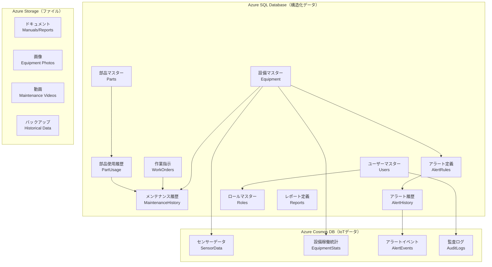

### 1.2 データベース選択理由

#### Azure SQL Database
- **ACID特性**: トランザクション整合性が重要なマスタデータ
- **複雑なクエリ**: JOINを多用する分析クエリに最適
- **レポート機能**: Power BIとの親和性が高い

#### Azure Cosmos DB
- **高スループット**: 大量のIoTデータ取り込み
- **水平スケーリング**: データ量増加に対応
- **低遅延**: リアルタイム監視要件に対応

#### Azure Storage
- **コスト効率**: 大容量ファイルの安価な保存
- **アクセス頻度**: 低頻度アクセスデータの長期保管

## 2. Azure SQL Database - 構造化データモデル

### 2.1 設備マスターテーブル（Equipment）

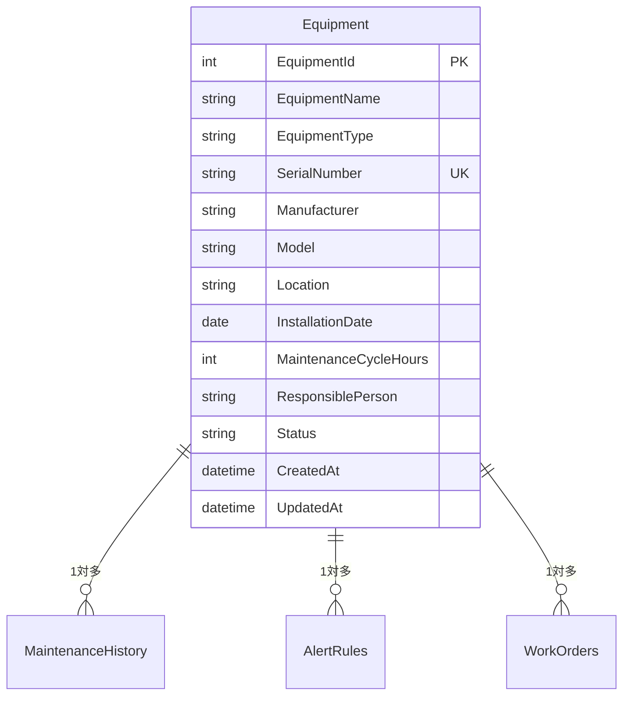

**テーブル仕様**:
```sql
CREATE TABLE Equipment (
    EquipmentId INT PRIMARY KEY IDENTITY(1,1),
    EquipmentName NVARCHAR(100) NOT NULL,
    EquipmentType NVARCHAR(50) NOT NULL,
    SerialNumber NVARCHAR(50) UNIQUE,
    Manufacturer NVARCHAR(100),
    Model NVARCHAR(100),
    Location NVARCHAR(100) NOT NULL,
    InstallationDate DATE NOT NULL,
    MaintenanceCycleHours INT NOT NULL,
    ResponsiblePerson NVARCHAR(100),
    Status NVARCHAR(20) DEFAULT 'Active', -- Active, Maintenance, Retired
    CreatedAt DATETIME2 DEFAULT GETDATE(),
    UpdatedAt DATETIME2 DEFAULT GETDATE()
);
```

### 2.2 メンテナンス関連テーブル

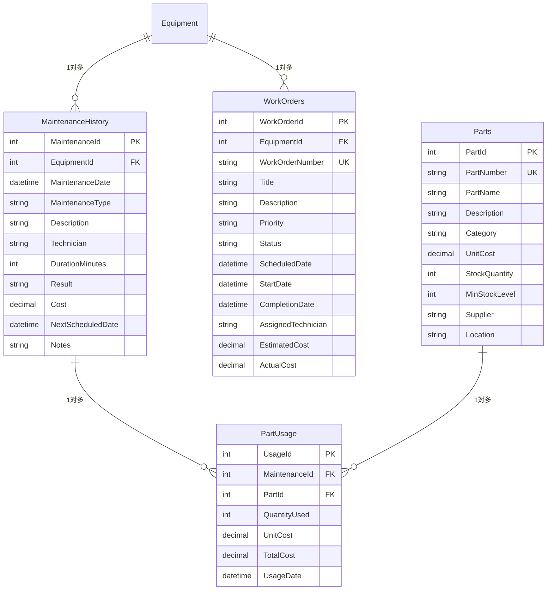

### 2.3 アラート・通知テーブル

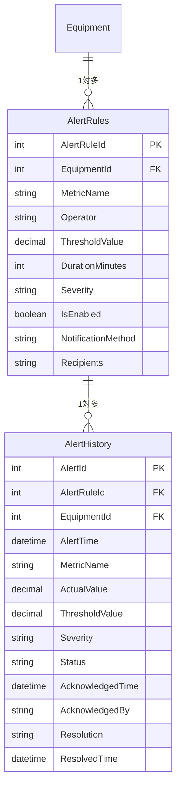

### 2.4 ユーザー・権限管理テーブル

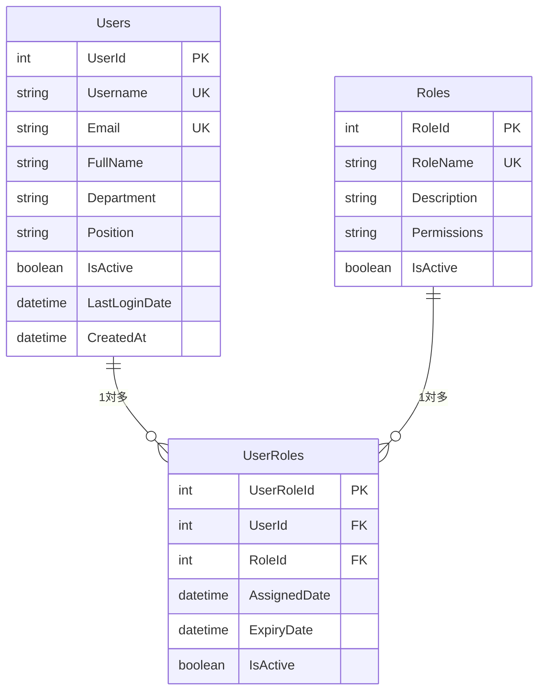

## 3. Azure Cosmos DB - NoSQLデータモデル

### 3.1 センサーデータコレクション

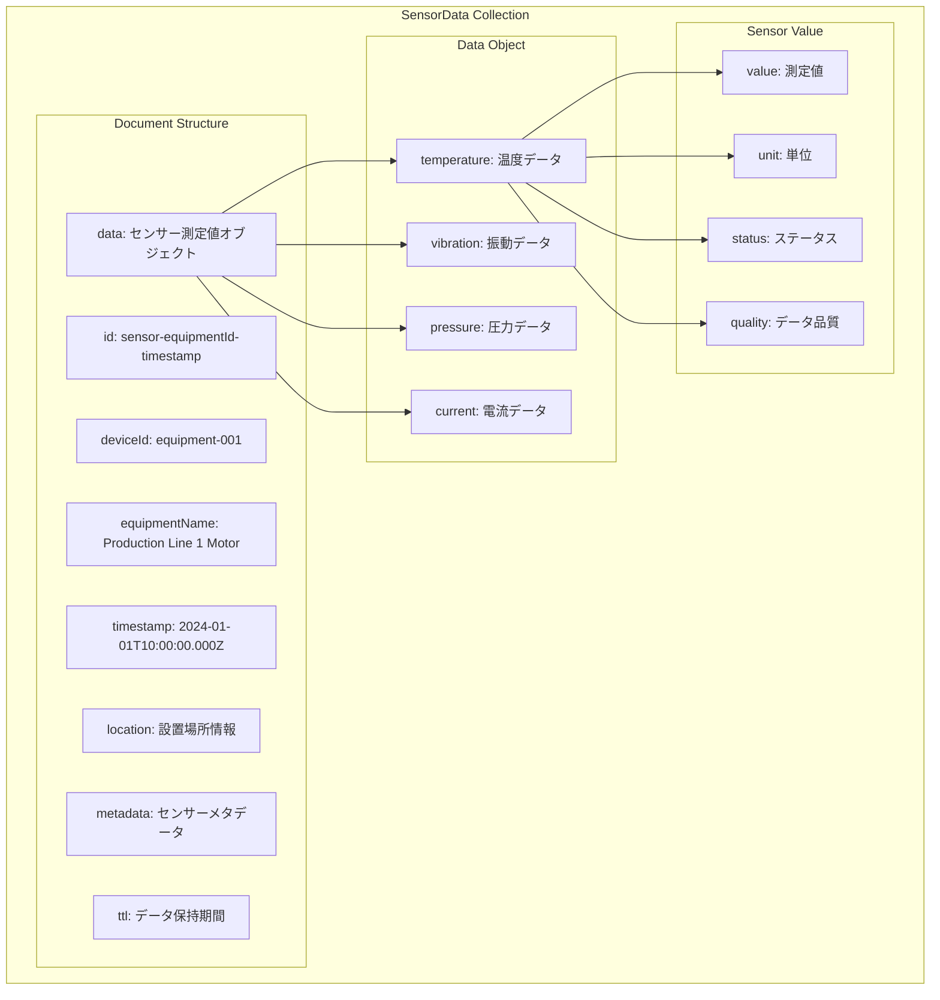

**ドキュメント例**:
```json
{
  "id": "sensor-equipment-001-20240101100000",
  "deviceId": "equipment-001",
  "equipmentName": "Production Line 1 Motor",
  "timestamp": "2024-01-01T10:00:00.000Z",
  "data": {
    "temperature": {
      "value": 75.5,
      "unit": "celsius",
      "status": "normal",
      "quality": "good"
    },
    "vibration": {
      "value": 2.3,
      "unit": "mm/s",
      "status": "normal",
      "quality": "good"
    },
    "pressure": {
      "value": 4.2,
      "unit": "bar",
      "status": "warning",
      "quality": "fair"
    },
    "current": {
      "value": 12.5,
      "unit": "ampere",
      "status": "normal",
      "quality": "good"
    }
  },
  "location": {
    "area": "production-floor-1",
    "coordinates": {
      "x": 15.5,
      "y": 23.1
    }
  },
  "metadata": {
    "firmwareVersion": "1.2.3",
    "lastCalibration": "2024-01-01T00:00:00.000Z",
    "sensorModel": "MultiSensor-Pro-v2"
  },
  "ttl": 7776000,
  "_ts": 1704110400
}
```

### 3.2 設備稼働統計コレクション

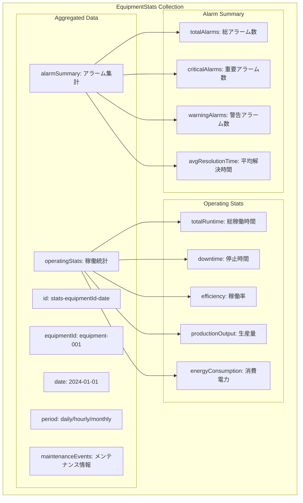

### 3.3 アラートイベントコレクション

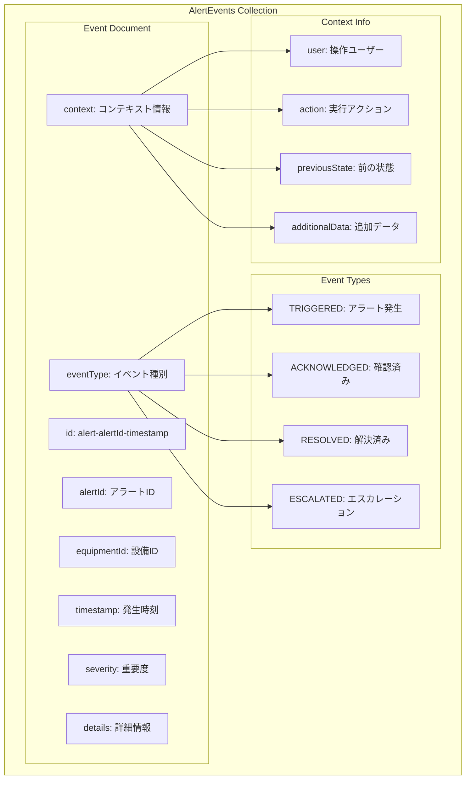

## 4. データ分散・パーティション戦略

### 4.1 Cosmos DB パーティション設計

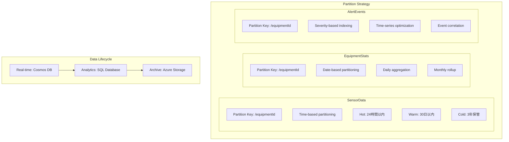

### 4.2 データアーカイブ戦略

#### データ階層化
- **ホットデータ（0-24時間）**: Cosmos DB（高性能SSD）
- **ウォームデータ（1-30日）**: SQL Database（標準SSD）
- **コールドデータ（30日-3年）**: Azure Storage（低コストHDD）

#### 自動アーカイブ
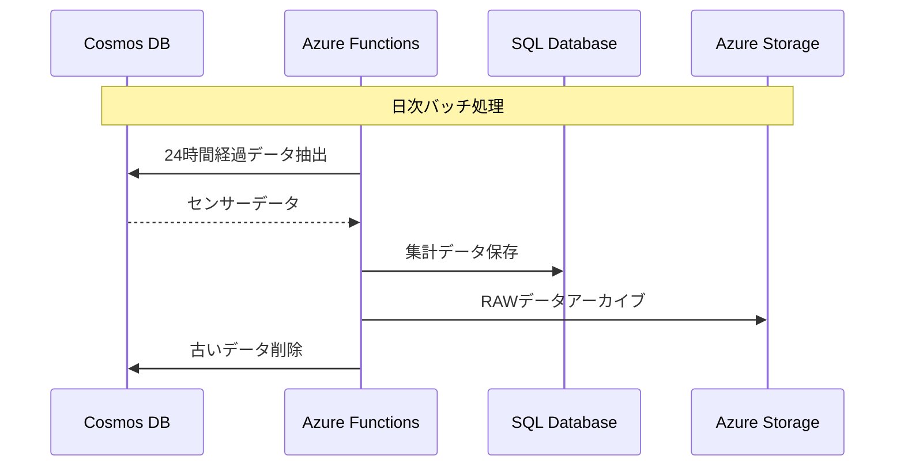

## 5. データ品質・バリデーション

### 5.1 データ検証ルール

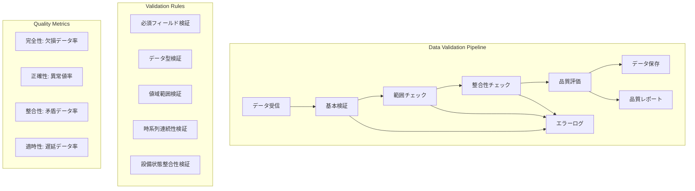

### 5.2 データ補完・修復

#### 欠損データ補完
- **線形補間**: 短時間の欠損（< 5分）
- **統計的推定**: 中時間の欠損（5-30分）
- **機械学習予測**: 長時間の欠損（> 30分）

#### 異常値処理
- **統計的外れ値検出**: Z-score、IQR法
- **時系列異常検出**: 季節分解、LSTM
- **多変量異常検出**: 相関分析、クラスタリング

## 6. データセキュリティ・プライバシー

### 6.1 暗号化戦略

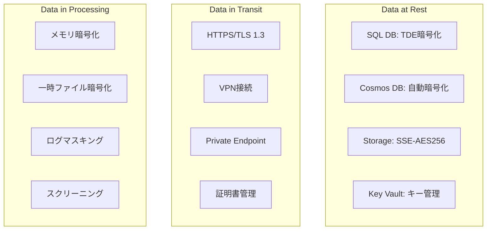

### 6.2 アクセス制御

#### データ分類
- **Public**: 一般的な設備情報
- **Internal**: 運用データ・統計情報
- **Confidential**: 性能データ・分析結果
- **Restricted**: 個人情報・セキュリティ情報

#### 最小権限アクセス
- **読み取り専用**: レポート閲覧者
- **データ入力**: 現場オペレーター
- **データ管理**: システム管理者
- **フルアクセス**: データベース管理者

## 7. パフォーマンス最適化

### 7.1 インデックス戦略

#### SQL Database
```sql
-- 設備マスター: 複合インデックス
CREATE INDEX IX_Equipment_Type_Location 
ON Equipment (EquipmentType, Location);

-- メンテナンス履歴: 時系列インデックス
CREATE INDEX IX_MaintenanceHistory_Date_Equipment 
ON MaintenanceHistory (MaintenanceDate DESC, EquipmentId);

-- アラート履歴: 複合インデックス
CREATE INDEX IX_AlertHistory_Status_Severity_Time 
ON AlertHistory (Status, Severity, AlertTime DESC);
```

#### Cosmos DB
```json
{
  "indexingPolicy": {
    "indexingMode": "consistent",
    "automatic": true,
    "includedPaths": [
      {
        "path": "/equipmentId/?",
        "indexes": [{"kind": "Hash"}]
      },
      {
        "path": "/timestamp/?",
        "indexes": [{"kind": "Range"}]
      },
      {
        "path": "/data/*/status/?",
        "indexes": [{"kind": "Hash"}]
      }
    ],
    "excludedPaths": [
      {
        "path": "/metadata/*"
      }
    ]
  }
}
```

### 7.2 クエリ最適化

#### データアグリゲーション
- **リアルタイム集計**: Stream Analytics
- **定期集計**: Azure Functions（タイマートリガー）
- **オンデマンド集計**: SQL Serverストアドプロシージャ

#### キャッシュ戦略
- **Redis Cache**: よく使用されるマスターデータ
- **Application Cache**: 計算済み統計データ
- **CDN**: 静的コンテンツ（レポートPDF等）

---

このデータモデル設計書により、大規模IoTデータの効率的な管理と高性能なアクセスを実現し、工場設備管理システムの要求を満たすことができます。