# 工場設備管理システム - プロジェクトマイルストーン設計書

## 1. プロジェクト概要とリソース分析

### 1.1 リソース状況と工数計算

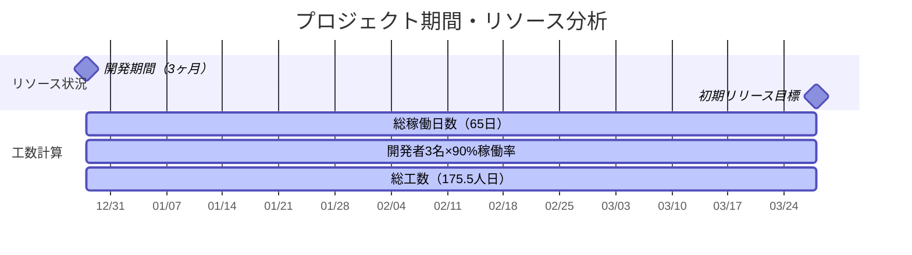

**計算過程：**
- **案件期間**: 2023/12/28 ～ 2024/3/28（3か月）
- **稼働日数**: 約65日間（土日・祝日除く）
- **開発リソース**: 3名 × 90% = 2.7人日/日
- **総工数**: 65日 × 2.7人日 = **175.5人日**

### 1.2 優先順位付けマトリックス

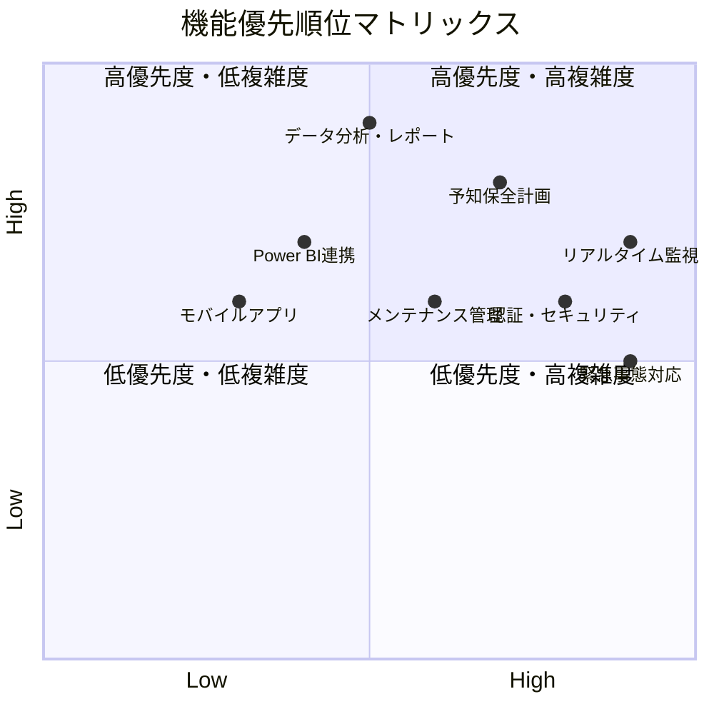

## 2. 全体マイルストーン計画

### 2.1 プロジェクト全体スケジュール

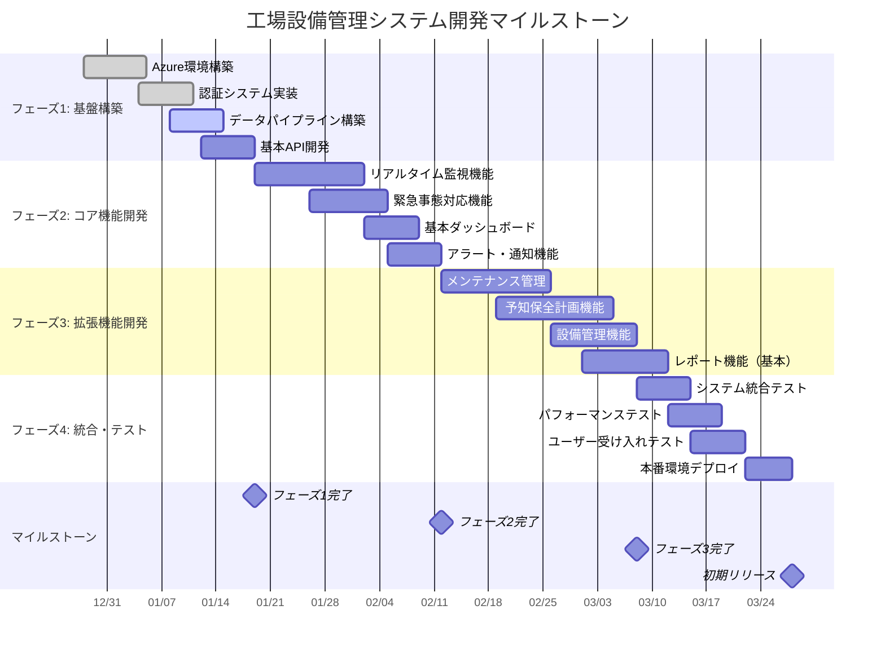

### 2.2 マイルストーン詳細と成果物

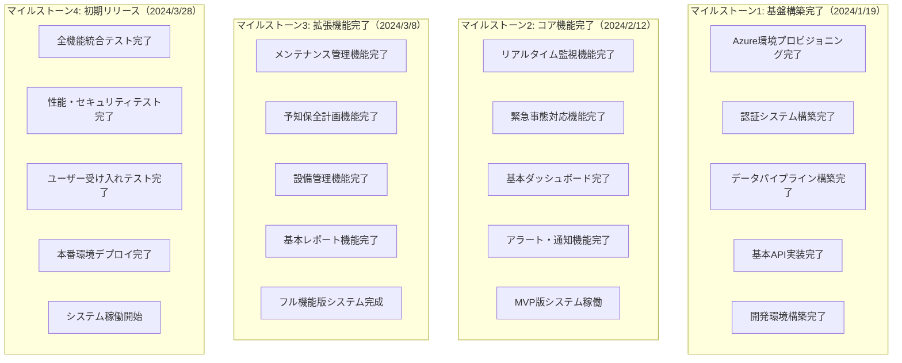

## 3. フェーズ別詳細計画

### 3.1 フェーズ1: 基盤構築（3週間・27人日）

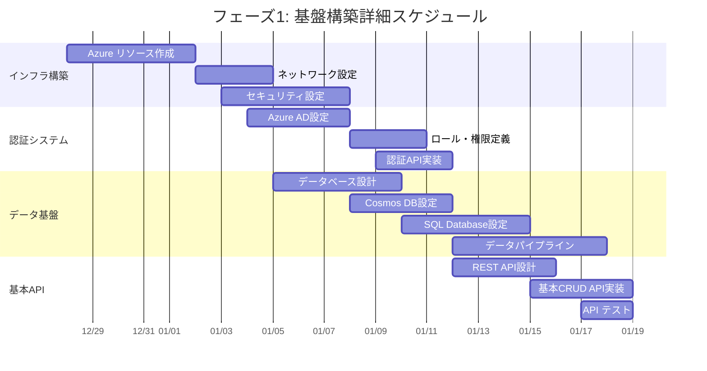

**フェーズ1成果物:**
- [ ] Azure 環境プロビジョニング完了
- [ ] 認証・認可システム稼働
- [ ] データベーススキーマ構築
- [ ] 基本API（CRUD操作）完成
- [ ] 開発・テスト環境構築

**工数配分:**
- インフラエンジニア: 12人日
- バックエンドエンジニア: 10人日
- フロントエンドエンジニア: 5人日

### 3.2 フェーズ2: コア機能開発（3.5週間・37人日）

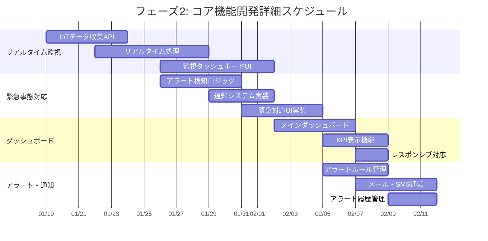

**フェーズ2成果物:**
- [ ] リアルタイム設備監視システム
- [ ] 緊急事態対応機能
- [ ] メインダッシュボード
- [ ] アラート・通知システム
- [ ] MVP版システム完成

**優先度最高の機能（初期リリース必須）:**
- UC001: リアルタイム設備監視 ✅
- UC005: 緊急事態対応 ✅

### 3.3 フェーズ3: 拡張機能開発（3.5週間・42人日）

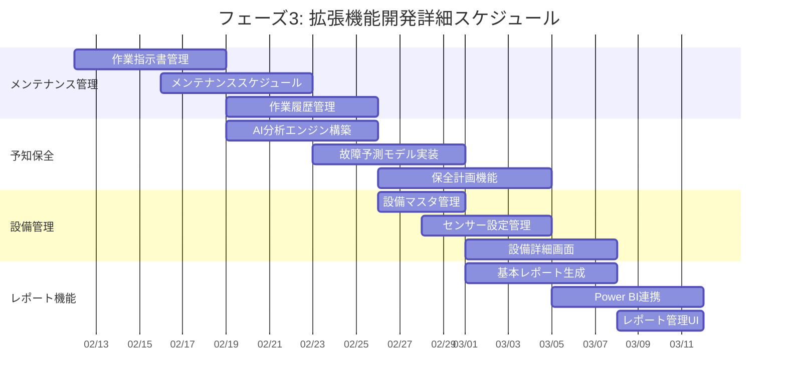

**フェーズ3成果物:**
- [ ] メンテナンス管理システム
- [ ] 予知保全計画機能
- [ ] 設備管理機能
- [ ] 基本レポート・分析機能
- [ ] フル機能版システム完成

**初期リリース対象:**
- UC002: 予知保全計画策定（基本版） ✅
- UC004: メンテナンス実行管理（基本版） ✅

### 3.4 フェーズ4: 統合・テスト（2.5週間・32人日）

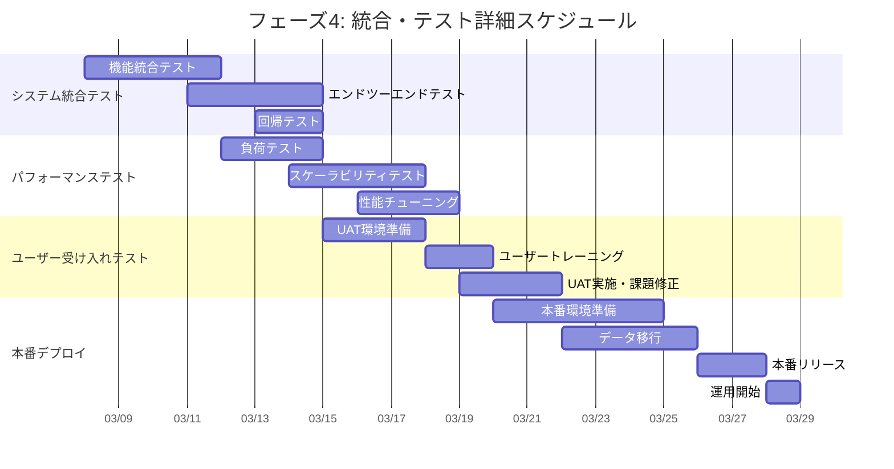

**フェーズ4成果物:**
- [ ] 統合テスト完了
- [ ] 性能・セキュリティテスト完了
- [ ] ユーザー受け入れテスト完了
- [ ] 本番環境デプロイ完了
- [ ] システム稼働開始

## 4. リスク管理とコンティンジェンシープラン

### 4.1 主要リスクとマイルストーンへの影響

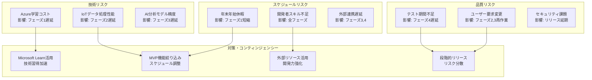

### 4.2 リスク対応スケジュール調整

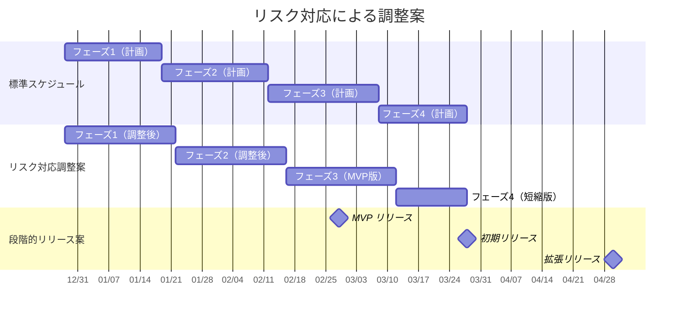

## 5. 成功指標とKPI

### 5.1 マイルストーン別成功指標

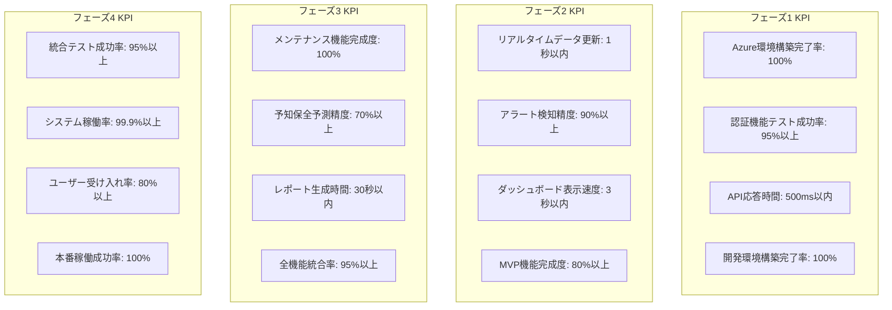

### 5.2 ビジネス成果指標

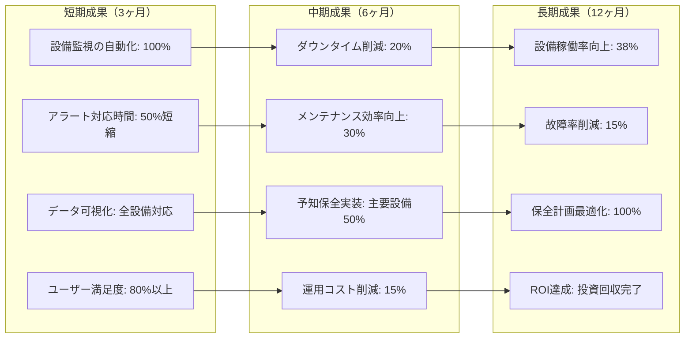

## 6. 拡張計画（フェーズ5以降）

### 6.1 拡張フェーズロードマップ

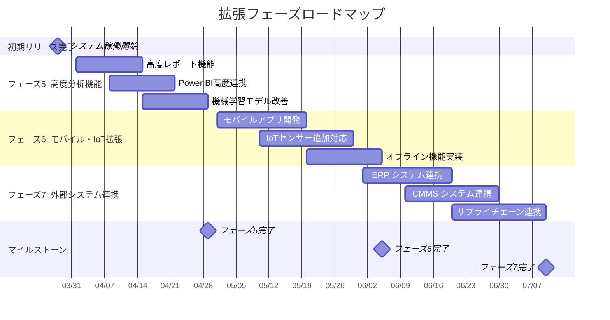

### 6.2 長期的なシステム進化

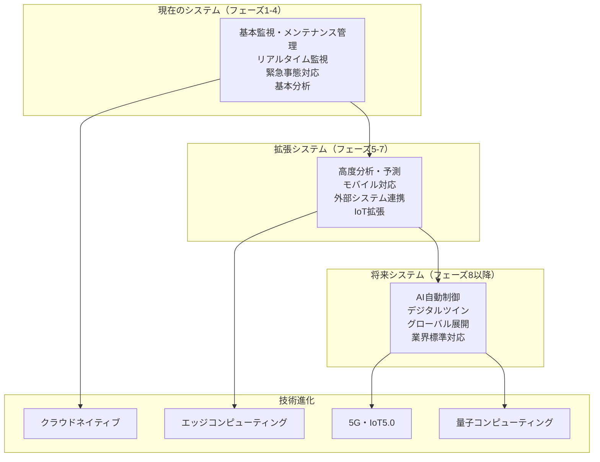

---

このプロジェクトマイルストーン設計書により、限られたリソースと期間で最大の価値を提供できる現実的で実行可能な計画を策定しました。初期リリースでは最重要機能に集中し、段階的な拡張により継続的な価値向上を実現します。