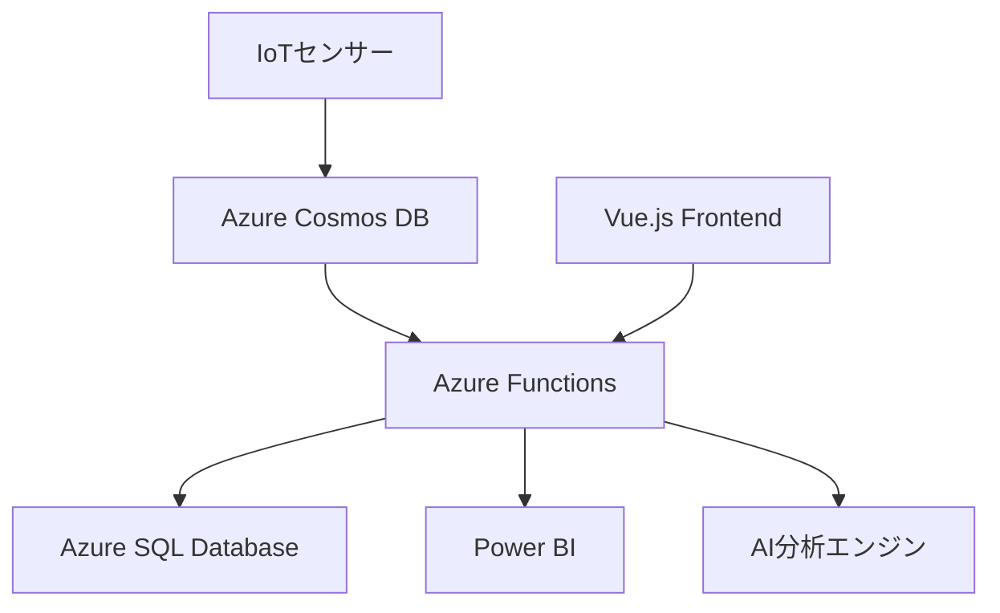

# 工場設備管理アプリ プロトタイプ開発プロジェクト

## 📋 プロジェクト概要

このプロジェクトは、**AI-Driven Development** 手法を活用した工場設備管理アプリケーションのプロトタイプ開発です。工場内の設備の稼働状況やメンテナンス情報を一元管理し、効率的な運用をサポートすることを目的としています。

### 🎯 主要目的

- **リアルタイム監視**: センサーデータによる設備稼働状況のリアルタイム監視
- **予防保全**: データ分析に基づく効率的なメンテナンス管理
- **運用最適化**: 稼働データ分析による生産性向上提案

### 🛠️ 技術スタック

#### クラウドサービス
- **Azure Functions**: サーバーレスデータ処理・分析
- **Azure SQL Database**: 構造化データの永続化
- **Azure Cosmos DB**: IoTデータのリアルタイム処理  
- **Power BI**: データ可視化・BI分析

#### 開発技術
- **言語**: Python（バックエンド）、JavaScript/Vue.js（フロントエンド）
- **開発環境**: Visual Studio Code、Azure CLI
- **開発手法**: AI-Driven Development

## 📂 プロジェクト構成

```
factory-management/
├── 📄 PROJECT_DESIGN.md      # プロジェクト全体設計書
├── 🔧 AZURE_SETUP.md         # Azureリソース作成手順
├── 💻 DEVELOPMENT_GUIDE.md   # 開発手順とガイドライン  
├── 📊 API_DESIGN.md          # データモデル・API設計
├── 🚀 DEPLOYMENT_GUIDE.md    # デプロイメント手順書
└── 📖 README.md              # このファイル
```

## 🚀 クイックスタート

### 1. Azureリソースのセットアップ
```bash
# Azure CLI でログイン
az login

# リソース作成（詳細は AZURE_SETUP.md を参照）
export RESOURCE_GROUP_NAME="rg-factory-management"
export LOCATION="japaneast"

az group create --name $RESOURCE_GROUP_NAME --location $LOCATION
```

### 2. 開発環境の構築
```bash
# Python環境セットアップ
python -m venv factory-management-env
source factory-management-env/bin/activate  # macOS/Linux
# factory-management-env\Scripts\activate   # Windows

# 必要パッケージのインストール
pip install azure-functions azure-cosmos pyodbc flask pandas
```

### 3. フロントエンド環境
```bash
# Vue.js プロジェクト作成
npm install -g @vue/cli
vue create factory-management-frontend
cd factory-management-frontend
npm install axios chart.js vue-chartjs vuetify
```

## 📚 ドキュメント

| ドキュメント | 説明 | 対象者 |
|-------------|------|-------|
| [PROJECT_DESIGN.md](./PROJECT_DESIGN.md) | システム全体の設計・アーキテクチャ | 全体設計者・アーキテクト |
| [AZURE_SETUP.md](./AZURE_SETUP.md) | Azureリソース作成手順（Azure CLI） | インフラエンジニア・初心者 |
| [DEVELOPMENT_GUIDE.md](./DEVELOPMENT_GUIDE.md) | 開発環境構築・コーディング規約 | 開発者 |
| [API_DESIGN.md](./API_DESIGN.md) | データモデル・REST API仕様 | バックエンド開発者 |
| [DEPLOYMENT_GUIDE.md](./DEPLOYMENT_GUIDE.md) | CI/CD・本番デプロイ手順 | DevOpsエンジニア |

## 🏗️ システムアーキテクチャ



### データフロー
1. **データ収集**: IoTセンサーからリアルタイムデータ収集
2. **データ処理**: Azure Functionsでデータ処理・分析
3. **データ保存**: SQL Database（マスタデータ）、Cosmos DB（IoTデータ）
4. **可視化**: Power BI ダッシュボード、Webアプリケーション

## 🎯 期待される成果

| 指標 | 目標 | 効果 |
|------|------|------|
| 設備ダウンタイム | 20%削減 | 生産効率向上 |
| メンテナンス効率 | 30%向上 | コスト削減 |
| 運用コスト | 15%削減 | ROI向上 |

## 🔧 開発フェーズ

### フェーズ1: 基盤構築（2週間）
- [x] プロジェクト設計書作成
- [ ] Azureリソースプロビジョニング
- [ ] 基本データパイプライン構築
- [ ] 認証システム実装

### フェーズ2: コア機能開発（3週間）
- [ ] リアルタイム監視機能
- [ ] 基本ダッシュボード
- [ ] データ収集・処理ロジック
- [ ] REST API実装

### フェーズ3: 拡張機能開発（3週間）
- [ ] メンテナンス管理機能
- [ ] データ分析・予測機能
- [ ] Power BIレポート作成
- [ ] アラート・通知機能

### フェーズ4: 統合・テスト（2週間）
- [ ] システム統合テスト
- [ ] パフォーマンステスト
- [ ] ユーザー受け入れテスト
- [ ] ドキュメント最終化

## 🤖 AI-Driven Development の活用

このプロジェクトでは、GitHub Copilot を活用した AI-Driven Development を実践します：

### 活用場面
- **コード生成**: API エンドポイント、データモデルの自動生成
- **テスト作成**: 単体テスト・統合テストの自動作成
- **ドキュメント**: API仕様書、コメントの自動生成
- **デバッグ**: エラー解析とソリューション提案

### ベストプラクティス
1. 明確なコメントで意図を記述
2. 関数名・変数名を意味のあるものに
3. エラーハンドリングも含めて提案を受ける
4. 生成されたコードのレビューを徹底

## 🔐 セキュリティ・コンプライアンス

- **認証**: Azure Active Directory統合
- **データ暗号化**: 転送時・保存時の暗号化
- **アクセス制御**: ロールベースアクセス制御（RBAC）
- **監査**: Application Insights による詳細ログ

## 📈 監視・運用

- **リアルタイム監視**: Application Insights
- **アラート**: Azure Monitor メトリックアラート
- **ログ分析**: Log Analytics ワークスペース
- **バックアップ**: 自動バックアップ・ディザスタリカバリ

## 🤝 コントリビューション

1. このリポジトリをフォーク
2. フィーチャーブランチを作成 (`git checkout -b feature/AmazingFeature`)
3. 変更をコミット (`git commit -m 'Add some AmazingFeature'`)
4. ブランチをプッシュ (`git push origin feature/AmazingFeature`)
5. プルリクエストを作成

## 📞 サポート・問い合わせ

- **プロジェクト管理**: GitHub Issues
- **技術的質問**: GitHub Discussions
- **緊急時**: プロジェクトチームへ直接連絡

## 📄 ライセンス

このプロジェクトは MIT ライセンスの下で公開されています。詳細は [LICENSE](LICENSE) ファイルを参照してください。

---

## 🔗 関連リンク

- [AI-Driven Development Workshop](https://dev-lab-io.github.io/aoai/scenario2/home) - 元のワークショップ
- [Azure Documentation](https://docs.microsoft.com/ja-jp/azure/) - Azure公式ドキュメント
- [GitHub Copilot](https://github.com/features/copilot) - AI プログラミングアシスタント
