# 工場設備管理システム - 画面遷移設計書

## 1. 画面遷移概要

### 1.1 アプリケーション全体の画面構成

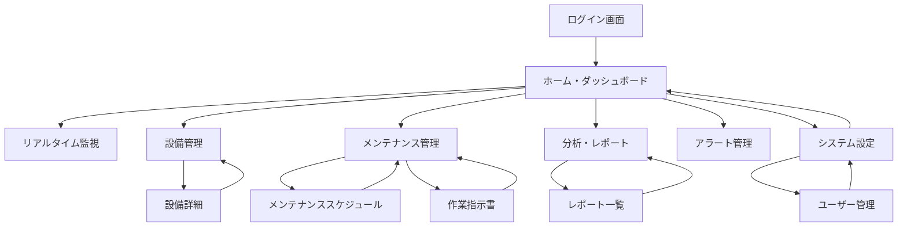
```mermaid
graph TB
    %% 認証・ホーム
    Login[ログイン画面]
    Home[ホーム・ダッシュボード]
    
    %% メイン機能画面
    Monitor[リアルタイム監視]
    Equipment[設備管理]
    Maintenance[メンテナンス管理]
    Analytics[分析・レポート]
    Alerts[アラート管理]
    
    %% サブ機能画面
    EquipmentDetail[設備詳細]
    MaintenanceSchedule[メンテナンススケジュール]
    WorkOrder[作業指示書]
    Reports[レポート一覧]
    Settings[システム設定]
    UserManagement[ユーザー管理]
    
    %% 画面遷移フロー
    Login --> Home
    Home --> Monitor
    Home --> Equipment
    Home --> Maintenance
    Home --> Analytics
    Home --> Alerts
    
    Equipment --> EquipmentDetail
    Maintenance --> MaintenanceSchedule
    Maintenance --> WorkOrder
    Analytics --> Reports
    Home --> Settings
    Settings --> UserManagement
    
    %% 戻り遷移
    EquipmentDetail --> Equipment
    MaintenanceSchedule --> Maintenance
    WorkOrder --> Maintenance
    Reports --> Analytics
    UserManagement --> Settings
    Settings --> Home
```

### 1.2 ユーザーロール別アクセス権限

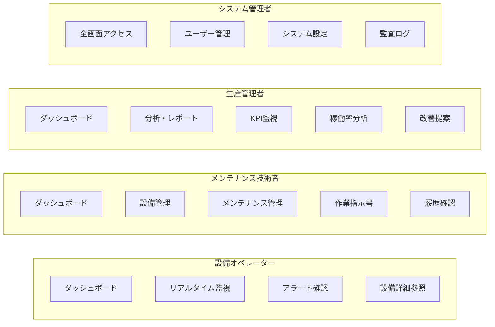
```mermaid
graph LR
    subgraph "設備オペレーター"
        O1[ダッシュボード]
        O2[リアルタイム監視]
        O3[アラート確認]
        O4[設備詳細参照]
    end
    
    subgraph "メンテナンス技術者"
        M1[ダッシュボード]
        M2[設備管理]
        M3[メンテナンス管理]
        M4[作業指示書]
        M5[履歴確認]
    end
    
    subgraph "生産管理者"
        P1[ダッシュボード]
        P2[分析・レポート]
        P3[KPI監視]
        P4[稼働率分析]
        P5[改善提案]
    end
    
    subgraph "システム管理者"
        S1[全画面アクセス]
        S2[ユーザー管理]
        S3[システム設定]
        S4[監査ログ]
    end
```

## 2. 認証・ダッシュボード画面

### 2.1 ログイン〜ダッシュボード遷移

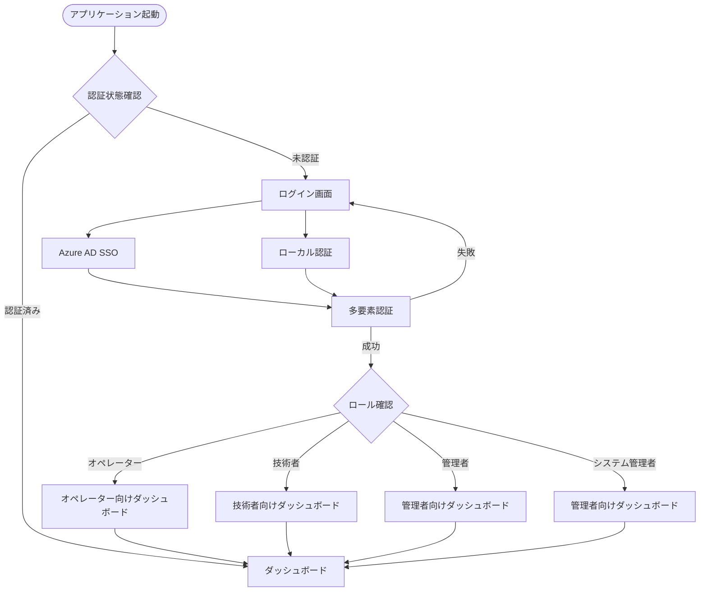
```mermaid
flowchart TD
    Start([アプリケーション起動]) --> Auth{認証状態確認}
    
    Auth -->|未認証| Login[ログイン画面]
    Auth -->|認証済み| Home[ダッシュボード]
    
    Login --> SSO[Azure AD SSO]
    Login --> Local[ローカル認証]
    
    SSO --> MFA[多要素認証]
    Local --> MFA
    
    MFA -->|成功| RoleCheck{ロール確認}
    MFA -->|失敗| Login
    
    RoleCheck -->|オペレーター| OpDash[オペレーター向けダッシュボード]
    RoleCheck -->|技術者| TechDash[技術者向けダッシュボード]
    RoleCheck -->|管理者| MgrDash[管理者向けダッシュボード]
    RoleCheck -->|システム管理者| AdminDash[管理者向けダッシュボード]
    
    OpDash --> Home
    TechDash --> Home
    MgrDash --> Home
    AdminDash --> Home
```

### 2.2 ダッシュボード画面構成

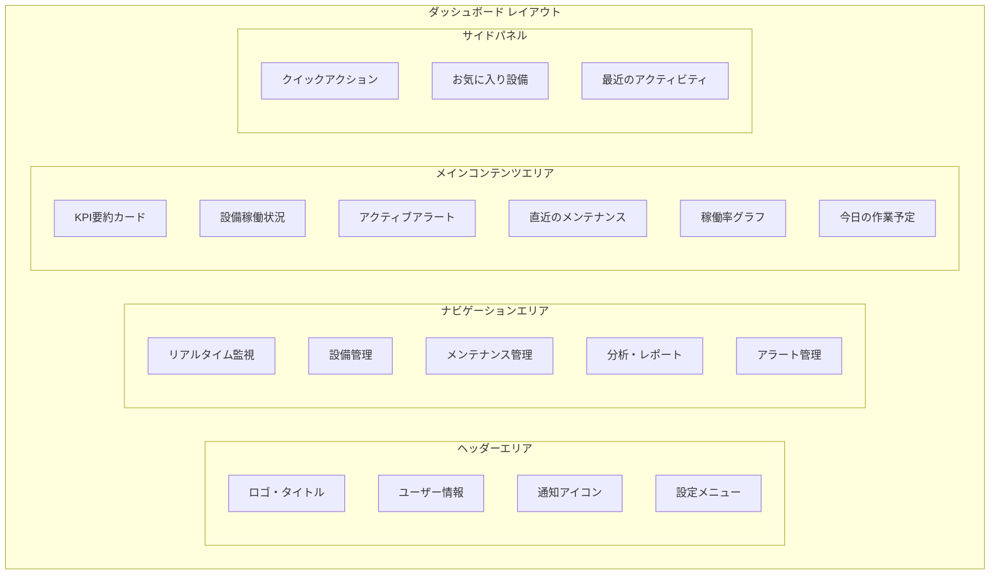
```mermaid
graph TB
    subgraph "ダッシュボード レイアウト"
        subgraph "ヘッダーエリア"
            H1[ロゴ・タイトル]
            H2[ユーザー情報]
            H3[通知アイコン]
            H4[設定メニュー]
        end
        
        subgraph "ナビゲーションエリア"
            N1[リアルタイム監視]
            N2[設備管理]
            N3[メンテナンス管理]
            N4[分析・レポート]
            N5[アラート管理]
        end
        
        subgraph "メインコンテンツエリア"
            C1[KPI要約カード]
            C2[設備稼働状況]
            C3[アクティブアラート]
            C4[直近のメンテナンス]
            C5[稼働率グラフ]
            C6[今日の作業予定]
        end
        
        subgraph "サイドパネル"
            S1[クイックアクション]
            S2[お気に入り設備]
            S3[最近のアクティビティ]
        end
    end
```

## 3. リアルタイム監視画面

### 3.1 監視画面遷移フロー

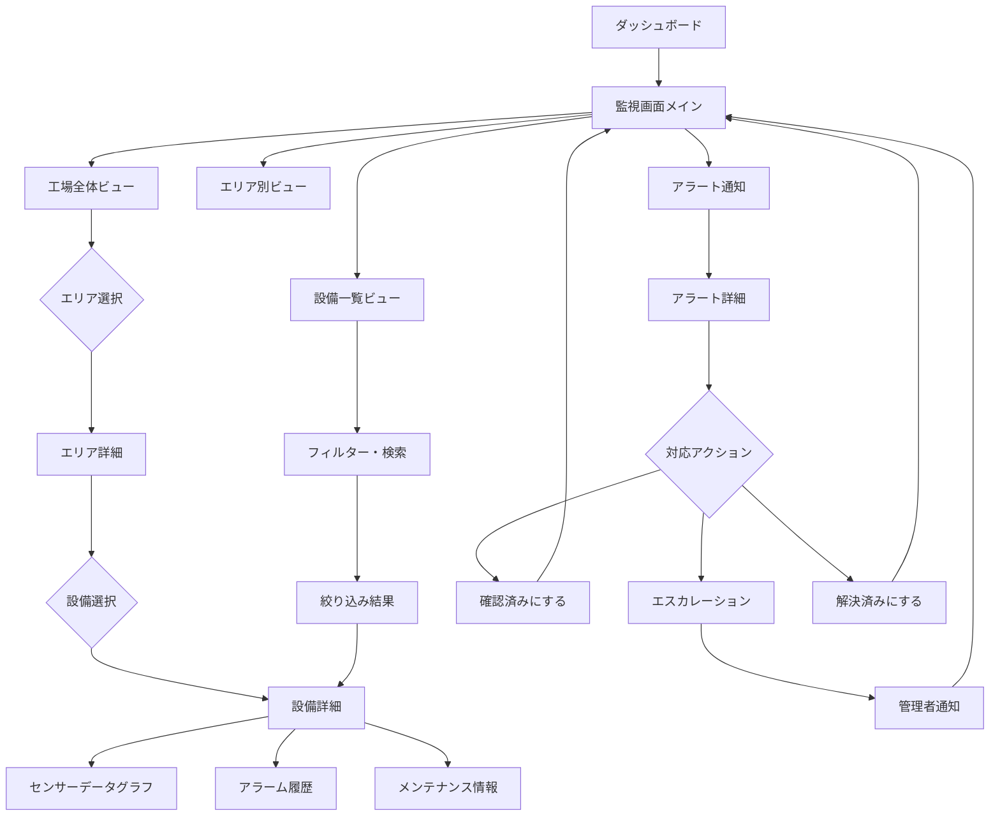
```mermaid
flowchart TD
    Dashboard[ダッシュボード] --> Monitor[監視画面メイン]
    
    Monitor --> PlantView[工場全体ビュー]
    Monitor --> AreaView[エリア別ビュー]
    Monitor --> EquipmentList[設備一覧ビュー]
    
    PlantView --> AreaSelect{エリア選択}
    AreaSelect --> AreaDetail[エリア詳細]
    
    AreaDetail --> EquipmentSelect{設備選択}
    EquipmentSelect --> EquipmentDetail[設備詳細]
    
    EquipmentList --> EquipmentFilter[フィルター・検索]
    EquipmentFilter --> FilteredList[絞り込み結果]
    FilteredList --> EquipmentDetail
    
    EquipmentDetail --> SensorGraph[センサーデータグラフ]
    EquipmentDetail --> AlarmHistory[アラーム履歴]
    EquipmentDetail --> MaintenanceInfo[メンテナンス情報]
    
    %% アラート発生時のフロー
    Monitor --> AlertNotif[アラート通知]
    AlertNotif --> AlertDetail[アラート詳細]
    AlertDetail --> AlertAction{対応アクション}
    
    AlertAction --> Acknowledge[確認済みにする]
    AlertAction --> Escalate[エスカレーション]
    AlertAction --> Resolve[解決済みにする]
    
    Acknowledge --> Monitor
    Escalate --> NotifyManager[管理者通知]
    Resolve --> Monitor
    NotifyManager --> Monitor
```

### 3.2 監視画面UI構成

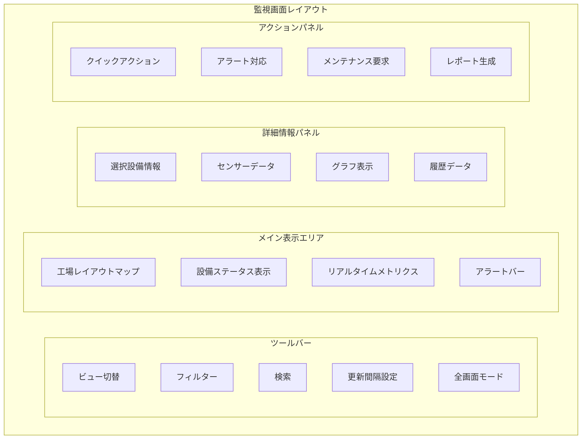
```mermaid
graph TB
    subgraph "監視画面レイアウト"
        subgraph "ツールバー"
            T1[ビュー切替]
            T2[フィルター]
            T3[検索]
            T4[更新間隔設定]
            T5[全画面モード]
        end
        
        subgraph "メイン表示エリア"
            M1[工場レイアウトマップ]
            M2[設備ステータス表示]
            M3[リアルタイムメトリクス]
            M4[アラートバー]
        end
        
        subgraph "詳細情報パネル"
            D1[選択設備情報]
            D2[センサーデータ]
            D3[グラフ表示]
            D4[履歴データ]
        end
        
        subgraph "アクションパネル"
            A1[クイックアクション]
            A2[アラート対応]
            A3[メンテナンス要求]
            A4[レポート生成]
        end
    end
```

## 4. 設備管理画面

### 4.1 設備管理画面遷移

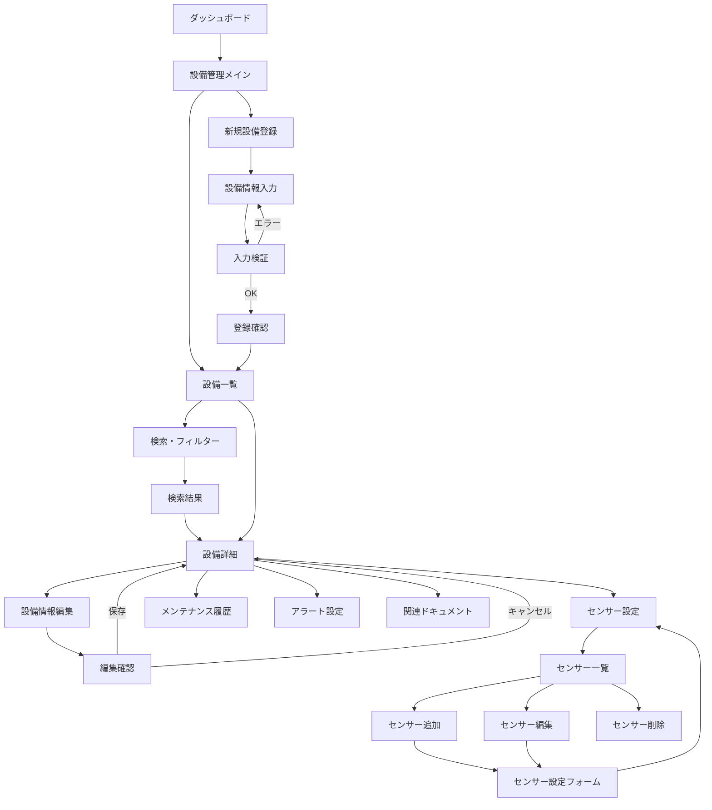
```mermaid
flowchart TD
    Dashboard[ダッシュボード] --> EquipmentMgmt[設備管理メイン]
    
    EquipmentMgmt --> EquipmentList[設備一覧]
    EquipmentMgmt --> AddEquipment[新規設備登録]
    
    EquipmentList --> Search[検索・フィルター]
    Search --> FilterResult[検索結果]
    
    FilterResult --> EquipmentDetail[設備詳細]
    EquipmentList --> EquipmentDetail
    
    EquipmentDetail --> EditEquipment[設備情報編集]
    EquipmentDetail --> SensorConfig[センサー設定]
    EquipmentDetail --> MaintenanceHistory[メンテナンス履歴]
    EquipmentDetail --> AlertConfig[アラート設定]
    EquipmentDetail --> Documents[関連ドキュメント]
    
    EditEquipment --> ConfirmEdit[編集確認]
    ConfirmEdit -->|保存| EquipmentDetail
    ConfirmEdit -->|キャンセル| EquipmentDetail
    
    AddEquipment --> EquipmentForm[設備情報入力]
    EquipmentForm --> ValidateForm[入力検証]
    ValidateForm -->|OK| ConfirmAdd[登録確認]
    ValidateForm -->|エラー| EquipmentForm
    ConfirmAdd --> EquipmentList
    
    %% センサー設定フロー
    SensorConfig --> SensorList[センサー一覧]
    SensorList --> AddSensor[センサー追加]
    SensorList --> EditSensor[センサー編集]
    SensorList --> DeleteSensor[センサー削除]
    
    AddSensor --> SensorForm[センサー設定フォーム]
    EditSensor --> SensorForm
    SensorForm --> SensorConfig
```

### 4.2 設備詳細画面構成

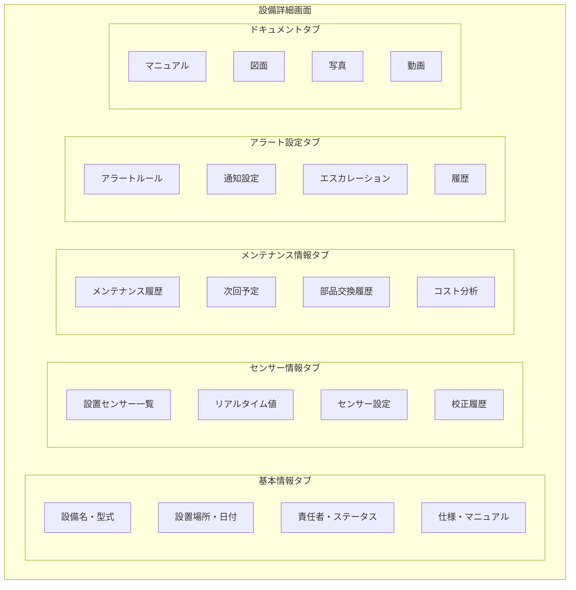
```mermaid
graph TB
    subgraph "設備詳細画面"
        subgraph "基本情報タブ"
            B1[設備名・型式]
            B2[設置場所・日付]
            B3[責任者・ステータス]
            B4[仕様・マニュアル]
        end
        
        subgraph "センサー情報タブ"
            S1[設置センサー一覧]
            S2[リアルタイム値]
            S3[センサー設定]
            S4[校正履歴]
        end
        
        subgraph "メンテナンス情報タブ"
            M1[メンテナンス履歴]
            M2[次回予定]
            M3[部品交換履歴]
            M4[コスト分析]
        end
        
        subgraph "アラート設定タブ"
            A1[アラートルール]
            A2[通知設定]
            A3[エスカレーション]
            A4[履歴]
        end
        
        subgraph "ドキュメントタブ"
            D1[マニュアル]
            D2[図面]
            D3[写真]
            D4[動画]
        end
    end
```

## 5. メンテナンス管理画面

### 5.1 メンテナンス管理画面遷移

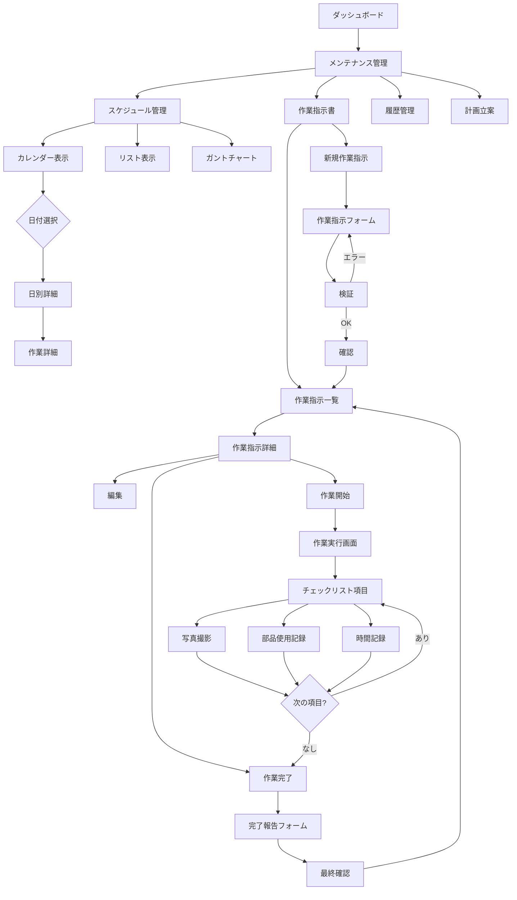
```mermaid
flowchart TD
    Dashboard[ダッシュボード] --> MaintenanceMgmt[メンテナンス管理]
    
    MaintenanceMgmt --> Schedule[スケジュール管理]
    MaintenanceMgmt --> WorkOrders[作業指示書]
    MaintenanceMgmt --> History[履歴管理]
    MaintenanceMgmt --> Planning[計画立案]
    
    %% スケジュール管理
    Schedule --> CalendarView[カレンダー表示]
    Schedule --> ListView[リスト表示]
    Schedule --> GanttView[ガントチャート]
    
    CalendarView --> DateSelect{日付選択}
    DateSelect --> DayDetail[日別詳細]
    DayDetail --> WorkOrderDetail[作業詳細]
    
    %% 作業指示書
    WorkOrders --> CreateWO[新規作業指示]
    WorkOrders --> WOList[作業指示一覧]
    
    WOList --> WODetail[作業指示詳細]
    WODetail --> EditWO[編集]
    WODetail --> StartWork[作業開始]
    WODetail --> CompleteWork[作業完了]
    
    CreateWO --> WOForm[作業指示フォーム]
    WOForm --> ValidateWO[検証]
    ValidateWO -->|OK| ConfirmWO[確認]
    ValidateWO -->|エラー| WOForm
    ConfirmWO --> WOList
    
    %% 作業実行フロー
    StartWork --> WorkExecution[作業実行画面]
    WorkExecution --> ChecklistItem[チェックリスト項目]
    ChecklistItem --> PhotoUpload[写真撮影]
    ChecklistItem --> PartUsage[部品使用記録]
    ChecklistItem --> TimeRecord[時間記録]
    
    PhotoUpload --> NextItem{次の項目?}
    PartUsage --> NextItem
    TimeRecord --> NextItem
    NextItem -->|あり| ChecklistItem
    NextItem -->|なし| CompleteWork
    
    CompleteWork --> CompletionForm[完了報告フォーム]
    CompletionForm --> FinalCheck[最終確認]
    FinalCheck --> WOList
```

### 5.2 作業指示書画面構成

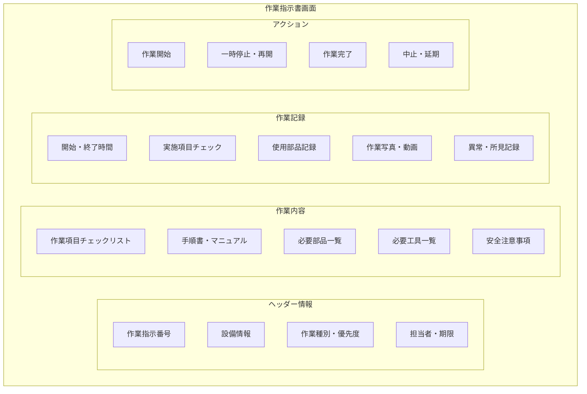
```mermaid
graph TB
    subgraph "作業指示書画面"
        subgraph "ヘッダー情報"
            H1[作業指示番号]
            H2[設備情報]
            H3[作業種別・優先度]
            H4[担当者・期限]
        end
        
        subgraph "作業内容"
            C1[作業項目チェックリスト]
            C2[手順書・マニュアル]
            C3[必要部品一覧]
            C4[必要工具一覧]
            C5[安全注意事項]
        end
        
        subgraph "作業記録"
            R1[開始・終了時間]
            R2[実施項目チェック]
            R3[使用部品記録]
            R4[作業写真・動画]
            R5[異常・所見記録]
        end
        
        subgraph "アクション"
            A1[作業開始]
            A2[一時停止・再開]
            A3[作業完了]
            A4[中止・延期]
        end
    end
```

## 6. 分析・レポート画面

### 6.1 分析画面遷移

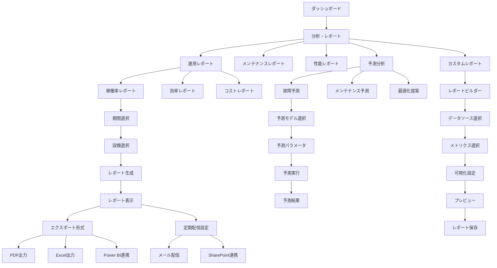
```mermaid
flowchart TD
    Dashboard[ダッシュボード] --> Analytics[分析・レポート]
    
    Analytics --> OperationalReports[運用レポート]
    Analytics --> MaintenanceReports[メンテナンスレポート]
    Analytics --> PerformanceReports[性能レポート]
    Analytics --> PredictiveAnalytics[予測分析]
    Analytics --> CustomReports[カスタムレポート]
    
    %% 運用レポート
    OperationalReports --> UpTimeReport[稼働率レポート]
    OperationalReports --> EfficiencyReport[効率レポート]
    OperationalReports --> CostReport[コストレポート]
    
    UpTimeReport --> TimeRange[期間選択]
    TimeRange --> Equipment[設備選択]
    Equipment --> GenerateReport[レポート生成]
    GenerateReport --> ReportView[レポート表示]
    
    %% 予測分析
    PredictiveAnalytics --> FailurePrediction[故障予測]
    PredictiveAnalytics --> MaintenancePrediction[メンテナンス予測]
    PredictiveAnalytics --> OptimizationSuggestion[最適化提案]
    
    FailurePrediction --> ModelSelect[予測モデル選択]
    ModelSelect --> PredictionParams[予測パラメータ]
    PredictionParams --> RunPrediction[予測実行]
    RunPrediction --> PredictionResult[予測結果]
    
    %% カスタムレポート
    CustomReports --> ReportBuilder[レポートビルダー]
    ReportBuilder --> DataSource[データソース選択]
    DataSource --> Metrics[メトリクス選択]
    Metrics --> Visualization[可視化設定]
    Visualization --> PreviewReport[プレビュー]
    PreviewReport --> SaveReport[レポート保存]
    
    %% レポート表示・エクスポート
    ReportView --> ExportOptions[エクスポート形式]
    ExportOptions --> PDFExport[PDF出力]
    ExportOptions --> ExcelExport[Excel出力]
    ExportOptions --> PowerBIExport[Power BI連携]
    
    ReportView --> Schedule[定期配信設定]
    Schedule --> EmailSchedule[メール配信]
    Schedule --> SharePoint[SharePoint連携]
```

### 6.2 分析画面UI構成

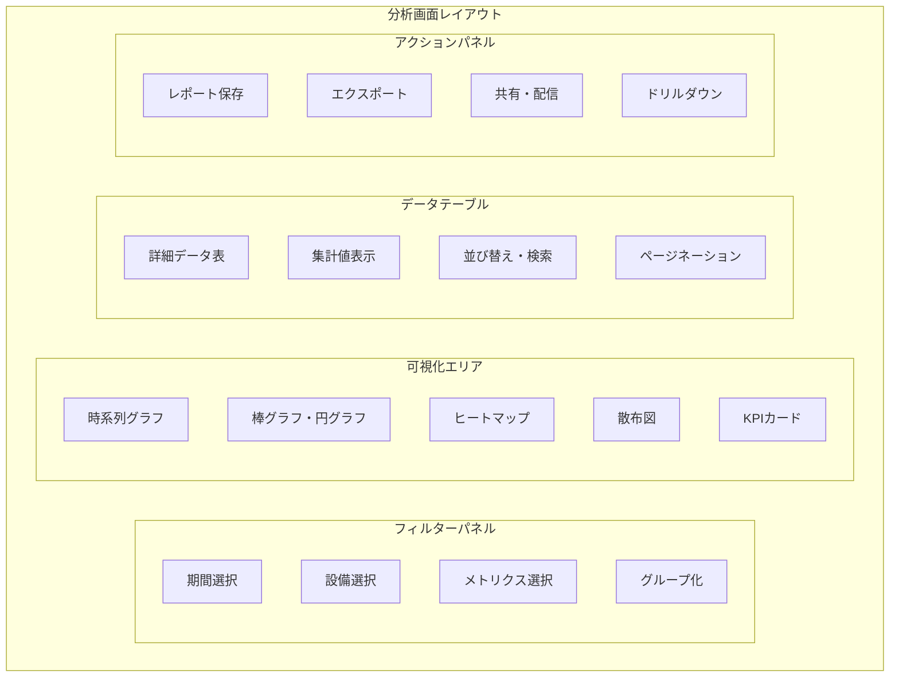
```mermaid
graph TB
    subgraph "分析画面レイアウト"
        subgraph "フィルターパネル"
            F1[期間選択]
            F2[設備選択]
            F3[メトリクス選択]
            F4[グループ化]
        end
        
        subgraph "可視化エリア"
            V1[時系列グラフ]
            V2[棒グラフ・円グラフ]
            V3[ヒートマップ]
            V4[散布図]
            V5[KPIカード]
        end
        
        subgraph "データテーブル"
            T1[詳細データ表]
            T2[集計値表示]
            T3[並び替え・検索]
            T4[ページネーション]
        end
        
        subgraph "アクションパネル"
            A1[レポート保存]
            A2[エクスポート]
            A3[共有・配信]
            A4[ドリルダウン]
        end
    end
```

## 7. アラート管理画面

### 7.1 アラート管理画面遷移

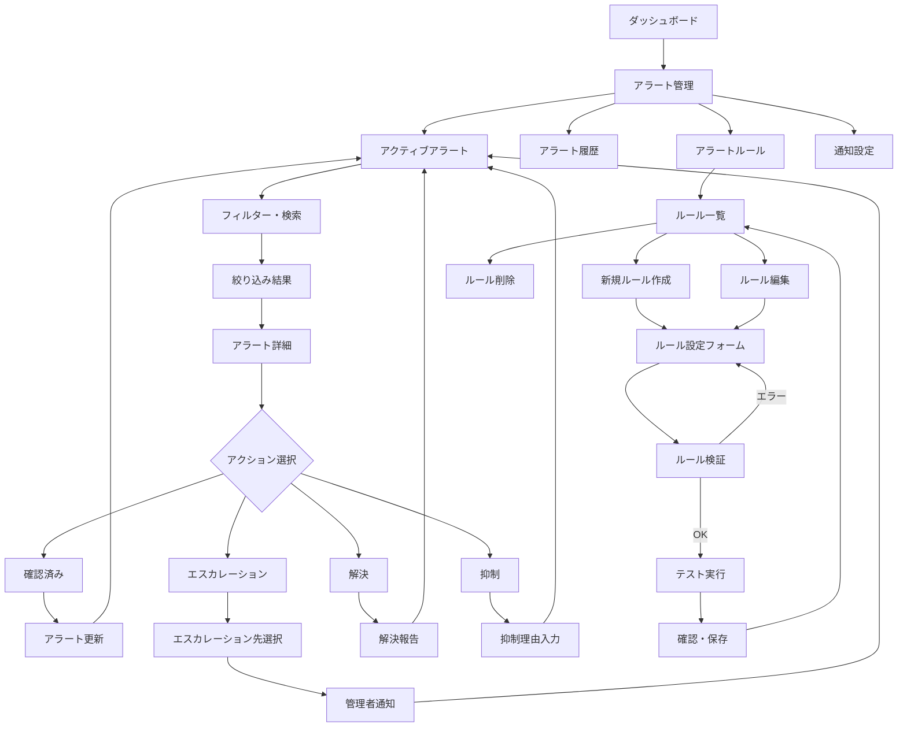
```mermaid
flowchart TD
    Dashboard[ダッシュボード] --> AlertMgmt[アラート管理]
    
    AlertMgmt --> ActiveAlerts[アクティブアラート]
    AlertMgmt --> AlertHistory[アラート履歴]
    AlertMgmt --> AlertRules[アラートルール]
    AlertMgmt --> NotificationSettings[通知設定]
    
    %% アクティブアラート
    ActiveAlerts --> AlertFilter[フィルター・検索]
    AlertFilter --> FilteredAlerts[絞り込み結果]
    FilteredAlerts --> AlertDetail[アラート詳細]
    
    AlertDetail --> AlertAction{アクション選択}
    AlertAction --> Acknowledge[確認済み]
    AlertAction --> Escalate[エスカレーション]
    AlertAction --> Resolve[解決]
    AlertAction --> Suppress[抑制]
    
    Acknowledge --> UpdateAlert[アラート更新]
    Escalate --> SelectEscalation[エスカレーション先選択]
    Resolve --> ResolutionForm[解決報告]
    Suppress --> SuppressionReason[抑制理由入力]
    
    UpdateAlert --> ActiveAlerts
    SelectEscalation --> NotifyManager[管理者通知]
    ResolutionForm --> ActiveAlerts
    SuppressionReason --> ActiveAlerts
    NotifyManager --> ActiveAlerts
    
    %% アラートルール管理
    AlertRules --> RuleList[ルール一覧]
    RuleList --> CreateRule[新規ルール作成]
    RuleList --> EditRule[ルール編集]
    RuleList --> DeleteRule[ルール削除]
    
    CreateRule --> RuleForm[ルール設定フォーム]
    EditRule --> RuleForm
    RuleForm --> ValidateRule[ルール検証]
    ValidateRule -->|OK| TestRule[テスト実行]
    ValidateRule -->|エラー| RuleForm
    TestRule --> ConfirmRule[確認・保存]
    ConfirmRule --> RuleList
```

### 7.2 アラート詳細画面構成

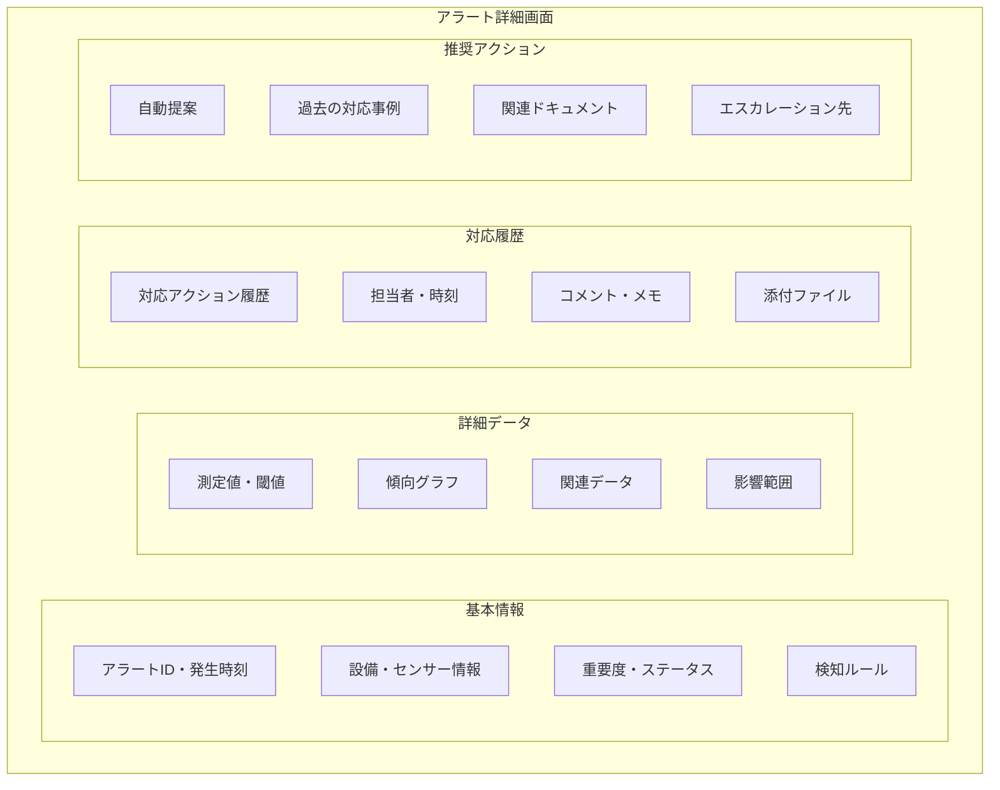
```mermaid
graph TB
    subgraph "アラート詳細画面"
        subgraph "基本情報"
            B1[アラートID・発生時刻]
            B2[設備・センサー情報]
            B3[重要度・ステータス]
            B4[検知ルール]
        end
        
        subgraph "詳細データ"
            D1[測定値・閾値]
            D2[傾向グラフ]
            D3[関連データ]
            D4[影響範囲]
        end
        
        subgraph "対応履歴"
            H1[対応アクション履歴]
            H2[担当者・時刻]
            H3[コメント・メモ]
            H4[添付ファイル]
        end
        
        subgraph "推奨アクション"
            R1[自動提案]
            R2[過去の対応事例]
            R3[関連ドキュメント]
            R4[エスカレーション先]
        end
    end
```

## 8. システム設定・管理画面

### 8.1 システム設定画面遷移

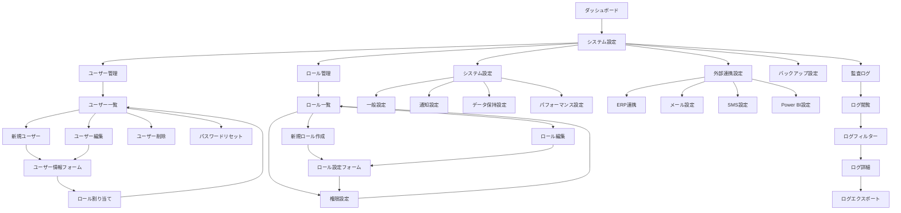
```mermaid
flowchart TD
    Dashboard[ダッシュボード] --> Settings[システム設定]
    
    Settings --> UserMgmt[ユーザー管理]
    Settings --> RoleMgmt[ロール管理]
    Settings --> SystemConfig[システム設定]
    Settings --> Integration[外部連携設定]
    Settings --> Backup[バックアップ設定]
    Settings --> AuditLog[監査ログ]
    
    %% ユーザー管理
    UserMgmt --> UserList[ユーザー一覧]
    UserList --> AddUser[新規ユーザー]
    UserList --> EditUser[ユーザー編集]
    UserList --> DeleteUser[ユーザー削除]
    UserList --> ResetPassword[パスワードリセット]
    
    AddUser --> UserForm[ユーザー情報フォーム]
    EditUser --> UserForm
    UserForm --> AssignRole[ロール割り当て]
    AssignRole --> UserList
    
    %% ロール管理
    RoleMgmt --> RoleList[ロール一覧]
    RoleList --> CreateRole[新規ロール作成]
    RoleList --> EditRole[ロール編集]
    RoleList --> Permission[権限設定]
    
    CreateRole --> RoleForm[ロール設定フォーム]
    EditRole --> RoleForm
    RoleForm --> Permission
    Permission --> RoleList
    
    %% システム設定
    SystemConfig --> GeneralSettings[一般設定]
    SystemConfig --> NotificationSettings[通知設定]
    SystemConfig --> DataRetention[データ保持設定]
    SystemConfig --> PerformanceSettings[パフォーマンス設定]
    
    %% 外部連携設定
    Integration --> ERPIntegration[ERP連携]
    Integration --> EmailSettings[メール設定]
    Integration --> SMSSettings[SMS設定]
    Integration --> PowerBISettings[Power BI設定]
    
    %% 監査ログ
    AuditLog --> LogViewer[ログ閲覧]
    LogViewer --> LogFilter[ログフィルター]
    LogFilter --> LogDetail[ログ詳細]
    LogDetail --> LogExport[ログエクスポート]
```

## 9. モバイル画面遷移

### 9.1 モバイルアプリ画面遷移

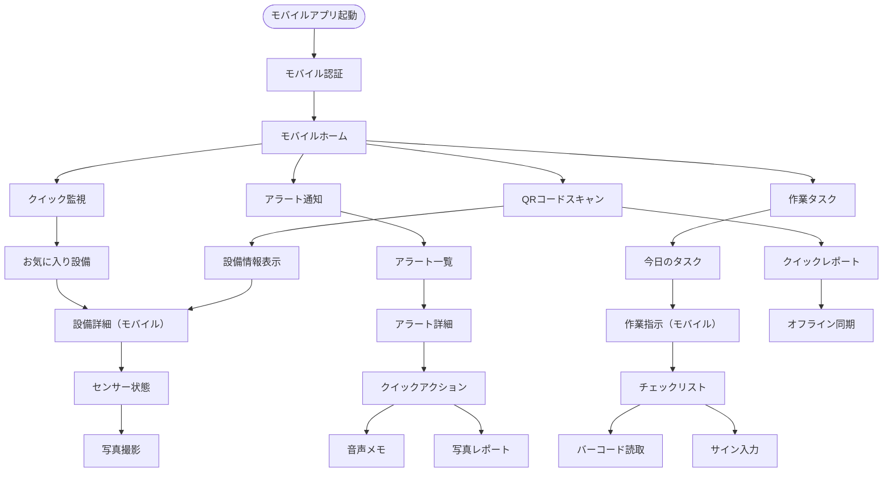
```mermaid
flowchart TD
    MobileStart([モバイルアプリ起動]) --> MobileAuth[モバイル認証]
    MobileAuth --> MobileHome[モバイルホーム]
    
    MobileHome --> QuickMonitor[クイック監視]
    MobileHome --> AlertNotif[アラート通知]
    MobileHome --> TaskList[作業タスク]
    MobileHome --> QRScan[QRコードスキャン]
    
    %% クイック監視
    QuickMonitor --> FavoriteEquipment[お気に入り設備]
    FavoriteEquipment --> MobileEquipmentDetail[設備詳細（モバイル）]
    MobileEquipmentDetail --> SensorStatus[センサー状態]
    SensorStatus --> PhotoCapture[写真撮影]
    
    %% アラート対応
    AlertNotif --> MobileAlertList[アラート一覧]
    MobileAlertList --> MobileAlertDetail[アラート詳細]
    MobileAlertDetail --> QuickAction[クイックアクション]
    QuickAction --> VoiceMemo[音声メモ]
    QuickAction --> PhotoReport[写真レポート]
    
    %% 作業タスク
    TaskList --> TodayTask[今日のタスク]
    TodayTask --> MobileWorkOrder[作業指示（モバイル）]
    MobileWorkOrder --> MobileChecklist[チェックリスト]
    MobileChecklist --> BarcodeRead[バーコード読取]
    MobileChecklist --> SignatureCapture[サイン入力]
    
    %% QRコードスキャン
    QRScan --> EquipmentInfo[設備情報表示]
    QRScan --> QuickReport[クイックレポート]
    EquipmentInfo --> MobileEquipmentDetail
    QuickReport --> OfflineSync[オフライン同期]
```

### 9.2 モバイル画面UI特徴

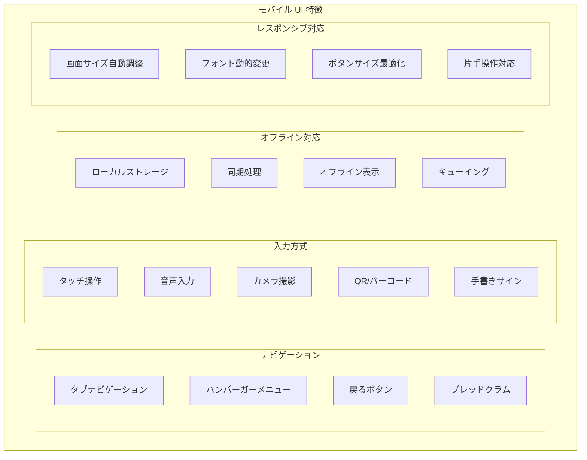
```mermaid
graph TB
    subgraph "モバイル UI 特徴"
        subgraph "ナビゲーション"
            N1[タブナビゲーション]
            N2[ハンバーガーメニュー]
            N3[戻るボタン]
            N4[ブレッドクラム]
        end
        
        subgraph "入力方式"
            I1[タッチ操作]
            I2[音声入力]
            I3[カメラ撮影]
            I4[QR/バーコード]
            I5[手書きサイン]
        end
        
        subgraph "オフライン対応"
            O1[ローカルストレージ]
            O2[同期処理]
            O3[オフライン表示]
            O4[キューイング]
        end
        
        subgraph "レスポンシブ対応"
            R1[画面サイズ自動調整]
            R2[フォント動的変更]
            R3[ボタンサイズ最適化]
            R4[片手操作対応]
        end
    end
```

## 10. エラー・例外処理画面

### 10.1 エラーハンドリング画面遷移

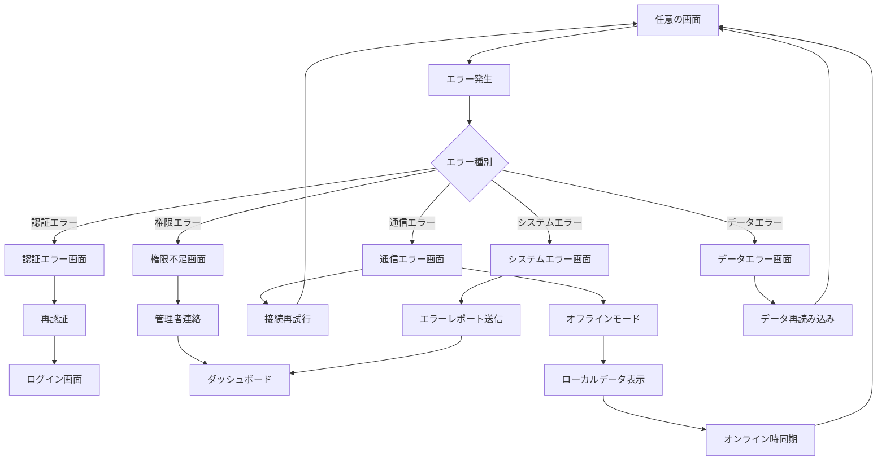
```mermaid
flowchart TD
    AnyScreen[任意の画面] --> ErrorOccur[エラー発生]
    
    ErrorOccur --> ErrorType{エラー種別}
    
    ErrorType -->|認証エラー| AuthError[認証エラー画面]
    ErrorType -->|権限エラー| PermissionError[権限不足画面]
    ErrorType -->|通信エラー| NetworkError[通信エラー画面]
    ErrorType -->|システムエラー| SystemError[システムエラー画面]
    ErrorType -->|データエラー| DataError[データエラー画面]
    
    AuthError --> ReAuth[再認証]
    ReAuth --> Login[ログイン画面]
    
    PermissionError --> ContactAdmin[管理者連絡]
    ContactAdmin --> Dashboard[ダッシュボード]
    
    NetworkError --> RetryConnection[接続再試行]
    NetworkError --> OfflineMode[オフラインモード]
    RetryConnection --> AnyScreen
    
    SystemError --> ErrorReport[エラーレポート送信]
    ErrorReport --> Dashboard
    
    DataError --> DataRefresh[データ再読み込み]
    DataRefresh --> AnyScreen
    
    %% オフラインモード
    OfflineMode --> LocalData[ローカルデータ表示]
    LocalData --> SyncWhenOnline[オンライン時同期]
    SyncWhenOnline --> AnyScreen
```

---

この画面遷移設計書により、ユーザーが直感的かつ効率的にシステムを操作できるUIフローを実現し、工場設備管理の業務をスムーズに実行できます。